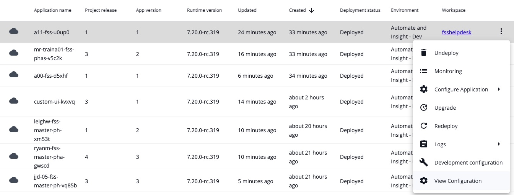
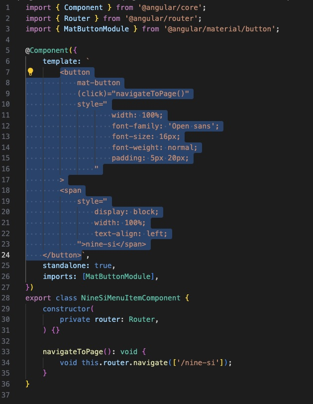
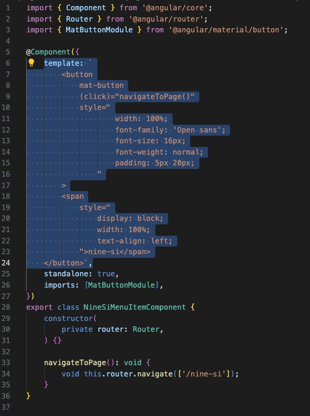
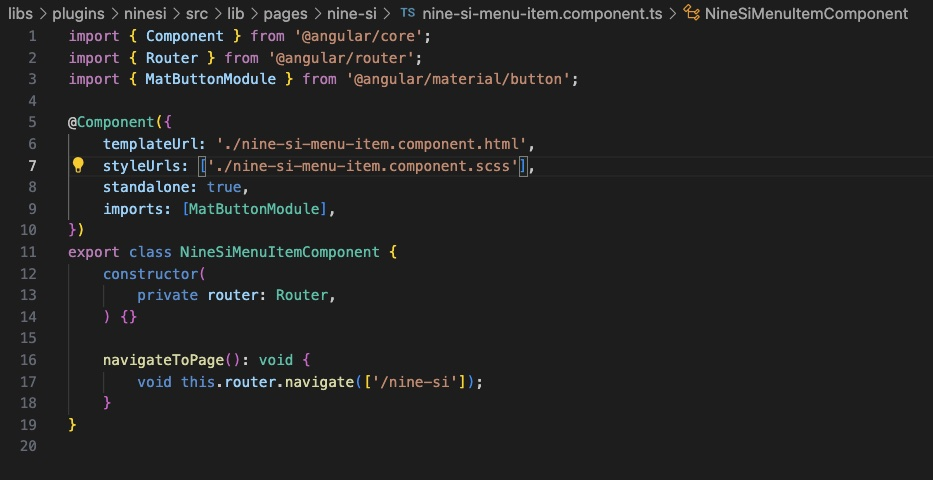
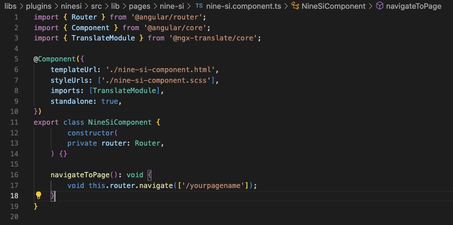
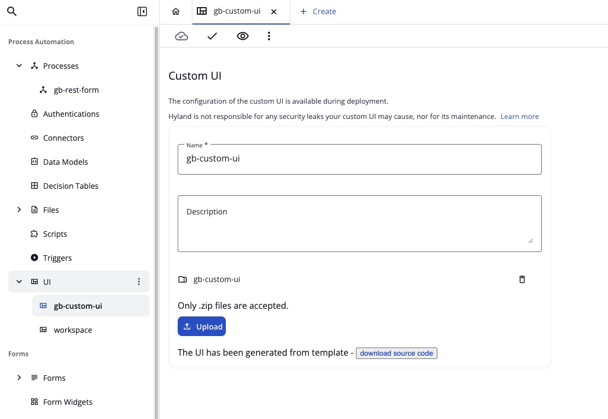

## Create a Custom UI Within Automate

**Disclaimer:** 
- Ensure you have installed nvm and Node.js by following the steps in the [ReadMe](/README.md) page.
- Using Visual Studio Code is strongly recommended since you'll be editing .html, .ts and .json files. You'll also need to use a Terminal window and VS Code allows you to open a terminal window from within the app to run necessary commands and provides a convenient dev experience.


**Scenario:** 
The idea is to create a custom UI experience for the Claims Team at **9 Second Insurance** that that delivers the following:
- Promotes the 9 Second Insurance theme and branding
- Provides access to engage processes that only the Claims Team needs (Start a Claim)
- Allows developers to create a portal for future content changes for this group (Future Development)
  - Metrics and Access to Knowledge Base
  - Engagement with Content Innovation: Knowledge Discovery / Knowledge Enrichment

---

### Import Project 
**(Skip this step if you attended day 1 and already have a project from that class)**
First, we'll import a project into CIC to use as a starting point.
1. Download the [completed project here](../Project-States/completed-project/gb-cui-claim-standalone.zip).
2. Sign into the [Content Innovation Cloud](https://www.experience.hyland.com/) and navigate to the **Studio Modeler** application.
3. Select the **Upload Project** button at the top of the page (right side).
4. In the file I/O browser, navigate to and select the .zip file you downloaded on step one.
5. If a prompt appears to name the project, give it a custom name then press the **Create Project** button. _(If this popup does not appear, select the eilpses and choose **edit project name**)_
```
[your initials]-cui-class
```
> Ex: _GB-cui-class_
6. You should be navigated to the process model application. Continue to the next section below.

---

### Generate a Custom UI & Download / Configure Source Code
**Summary:** 
This portion will show you how to create a custom UI within your application, download the source code, and configure a local development environment.
1. Within Automate Studio Modelling, select the **Create Custom UI** option from the UI drop-down header in the left menu.


2. In the pop-up box, give it a name and optional description. ```claims-portal```

3. On the Custom UI Configuration page (should automatically navigate to this), select the **“Generate from template <>”** button. The page will generate a template and display a **download source code** button below the configuration details.

4. Select the **download source code** button. A zip file containing the source code for the UI will be downloaded. Place the file on your local machine where you want it and unzip the file. You now have the UI downloaded.


5. Release the application containing the custom UI you just downloaded. 

6. Within Studio Admin, deploy the process. On the first tab of the deployment wizard, **select the Enable local development checkbox**. This is necessary in order to run the Custom UI from your local machine during development - VERY IMPORTANT!

7. Once Deployed, from the running Application Instance menu, choose **Development Configuration**.


8. Use the **Copy as JSON** hyperlink on the popup window to copy the config as JSON to your clipboard and save it to a notepad / document locally on your machine. You'll use this code later in your local dev environment. 

9. If you have not already, unzip the source code archive you downloaded in step 4. Navigate to and open the file named: **contexts.json5** located at the following directory: ```config\contexts.json5```. Paste the copied JSON from Step 8 over the entire contents of this file. SAVE IT! You may close the file once this is done, as you will not edit it any more.

10. Next, you'll need to open a Terminal window at the root directory of the downloaded source code. If this is new to you, here are the ways you can easily do this:
    - **Using Visual Studio Code:** In VSCode, use the **File** drop down selection at the top of the window and select _Open Folder_. Navigate to and select the folder of the downloaded source code. Once opened, you'll notice that the file heirarchy will be on the left side panel, which will give you access to open and edit files within the UI structure for later. To open a terminal window, select the **Terminal** drop-down at the top of the window and select _New Terminal_. A terminal panel will open at the bottom of VS code placing you in the directory of the folder you opened in this step. You're now ready to proceed to the next step of running the terminal commands.
    - **MAC OS: Using Terminal outside of VS Code:** Using your file explorer (Finder), navigate to the folder of your downloaded source code. RIGHT-CLICK on the folder and select _services_ from the right-click menu. Select _New Terminal at Folder_ from the menu. A terminal window should open at the file location. You're now ready to proceed to the next step of running the terminal commands.
> Go <a href="supporting-information/angular-file-structure.md" target="_blank">HERE</a> for an explanation on the **Angular Application File Structure**.
11. Install all the necessary dependencies by running the following command in Terminal:
    - Run the following command:  
        ```
        npm i
        ```
    - This command will install the necessary dependencies that are stipulated in your _package.json_ file. 
> Go <a href="supporting-information/dependencies.md" target="_blank">HERE</a> for an explanation on **Dependencies in an ADF application**.

12. Set up the environment variables by running the following command in Terminal:
    - Run the following command:  
        ```
        npm run setenv
        ```  
    - You should get a response that says: ```App specific variables written into: apps/workspace-hxp/.env```  

13. Start the Angular Application from Terminal:
    - Run the following command:  
        ```
        npm start workspace-hxp
        ```
    - Once building the UI is complete it should launch automatically in a browser window, but in case it does not you can view the UI manually by opening your browser and navigating to this address: ```http://localhost:4200/```  

14. Your Custom UI should launch in the web browser and will look like the default UI. Some things to note:
    - Your local UI will be running in your localhost. Remember to STOP the local UI whenever you are done testing it (and before proceeding to the next section). You can stop the local environment from running by pressing CTRL+C in the terminal window.
    - Being an asynchronous Angular environment, most changes can be made to the files while the UI is running. Editing and saving a file will automatically update/refresh the UI.

---

### Creating a Plugin and a Page
**Summary:** 
A Plugin is first necessary in order to create a Page, so don't skip step 1. A Page loads into the main content window of the UI. This guide will show you how to create and customize your own page and add a button for navigation.
1. **Creating a Plugin:** Open a Terminal window at the root directory of the downloaded source code (if not already open from the previous section). Paste and execute the command below to create a plugin for your page:
**NOTE: I titled my plugin "ninesi". Replace the text "ninesi" in this command line with the title you want to use. This will not be the formal name of your page, just the behind-the-scenes name for your plugin. For simplicity, feel free to use my plugin and page names unless you prefer your own names.** 
```
npx nx generate @hyland/extend:plugin --name ninesi --author "Greg Bousley" --addTranslations true
```
   - You should receive a logged response that files were created and updated.
   - The Plugin created will not have any noticeable functionality, but will add configuration to the correct files to support the page you'll create in step 2. 
2. **Create a Page** Execute the following command in order to create a page with button added to the left pane to navigate to your page:  
**NOTE: You must replace the text "ninesi" in this code with the same plugin name you used in step 1 (if you used your own plugin name) **AND** replace the text "nine-si" with the formal name of the page you want to create (if you're using your own page name). Also, do not use any spaces or numbers when creating a page name as it does not work with the generator (The actual formal name that is displayed on buttons / pages can be edited later).**
```
npx nx generate @hyland/extend:page --pluginName ninesi --pageName nine-si
```
   - You should receive a logged response that files were created and updated.
   > Go <a href="supporting-information/plugin-page.md" target="_blank">HERE</a> for an explanation for Pugins and Pages in this context.
3. Run the build command in order to test that your plugin page is working. You should see a new button at the bottom of the left hand navigation pane with the name of the page you specified. Click the button and you'll see a generic message in the main content pane that the plugin is working.
```
npm start workspace-hxp
```
   - Verify your page in the UI: A button should now appear at the bottom of the left navigation panel indicating your page name. Selecting the button will load the page into the main content window with a message that page is working. 
4. If your page is working, navigate back to terminal and stop the instance using CTRL+C.
5. The plugin generator created new files for this plugin, which can be found at the following directory. Open finder/explorer and navigate to this directory: ```libs/plugins/yourpluginname/src/lib/pages/nine-si```.
   - You should see a few files here: ```nine-si-menu-item.components.ts```, ```nine-si-compnents.ts```, and ```nine-si-module.ts```.
6. In order to create a custom page you'll need to create a few new files in this directory and paste some html code into those files. I found it easiest to use Visual Studio to create a these new files and save them in the directory mentioned above. To start creating the files, follow these steps in VS Code:
   - Create a new file titled ```nine-si-menu-item.component.scss``` and save it in the directory you have opened from step 5: ```libs/plugins/yourpluginname/src/lib/pages/nine-si```. Leave the contents of this file empty and close it. 
   - Create a new file titled ```nine-si-menu-item.component.html``` and save it in the directory you have opened from step 5: ```libs/plugins/yourpluginname/src/lib/pages/nine-si```.
   - Open the file in that same directory that is titled: ```nine-si-menu-item.component.ts``` in Visual Studio. In this file, you'll notice a string of HTML code that is surrounded by a single quote (literal string) which is the value of the "template" object. Copy the code between the single quotes, **do not copy the quotes**, and paste the code into the newly created .html file from the step above. (See this screenshot as an example of what to copy).

     - Inside of the ```nine-si-menu-item.component.ts``` file, you will replace the template object with the following 2 lines of code, ensuring that you use **your page names** in these lines. Refer to the before and after images below:
code:
```
    templateUrl: './nine-si-menu-item.component.html',
    styleUrls: ['./nine-si-menu-item.component.scss'],
```

* This is the code you will replace:<br>


* This what it should look like afterward (but using your page names in place of "nine-si" in this image if you used custom names):


   - Create a new file titled ```nine-si-component.scss``` and save it in the directory you have opened from **step 5**: ```libs/plugins/yourpluginname/src/lib/pages/nine-si```. Leave the contents of this file blank and close it.
   - Create a new file titled ```nine-si-component.html``` and save it in the directory you have opened from **step 5**: ```libs/plugins/yourpluginname/src/lib/pages/nine-si```. 
   - Next, we will edit the component file that will reference the html & css files we created as well as add the functionality to launch a page and start a process. Open the file in this same directory titled: ```nine-si.component.ts```.
     - In this file, you will replace the **template** and **selector** properties from the @Component with two properties for **templateUrl** and **styleUrls** with relative paths to the html and style sheet files that you just created using the following code. 
```
    templateUrl: './nine-si-component.html',
    styleUrls: ['./nine-si-component.scss'],
```
   - Next, at the top of the file, add the following import: 
```
import { Router } from '@angular/router';
```
   - Finally, within the **export class** constructor (inside of the brackets "{}") **Note: do not remove the "./"**:
```
    constructor(
        private router: Router,
    ) {}

    navigateToPage(): void {
        void this.router.navigate(['/nine-si']);
    }
```
   - Refer to the screenshot below as to what your file should look like (remembering to replace my page name with yours):


7. Open the file you created earlier titled ```nine-si-component.html``` and add the following code:  
```
<p>This is working!</p>
```
8. All manual file additions and edits are done for core functionality and you may now test the application.
   - Ensuring all edited files are saved, go back to Terminal and launch the UI using the command: 
```
npm start workspace-hxp
```
   - When the UI loads, click on the button that appears (your page name) below the navigation on the left-side panel to load your page. You should see the message in the main content pane: ```This is working!```.

> [!IMPORTANT]
> **Troubleshooting:**
>
> Ensure you created the files in the correct directory: `libs/plugins/yourpluginname/src/lib/pages/nine-si`.  
> You should have the following files: `nine-si-component.html`, `nine-si.component.ts`, `nine-si-menu-item.component.ts`, `nine-si-menu-item.component.html`.


---

### Customizing Your Page
1. Since this HTML code loads a an image, we need to create the proper directory so the image will exist at run-time. In finder/explorer, navigate to the directory at the following path: ```libs/plugins/yourpluginname/src/lib/pages/nine-si``` and create a new folder titled ```images```. Place the image file from this github found [here](./images-for-ui/) into the _images_ folder. 
2. If your UI is running, stop the UI by pressing CTRL+C in the Terminal window. Next, you'll add custom HTML code to create custom page design:
   - In the ```nine-si-component.html``` replace the contents of this file with the following code. **NOTE:** You MUST replace the ```yourprocessname``` in the "a href" URL in the code below with the name of the process in your application. (If you want to use your own html code then feel free to use that instead)
```
<!DOCTYPE html>
<html lang="en">
<head>
<meta charset="UTF-8">
<meta name="viewport" content="width=device-width, initial-scale=1.0">
<title>9 Second Insurance - Home Claims</title>
<style>
    /* General styles */    
    body {
        font-family: Arial, sans-serif;
        margin: 0;
        padding: 0;
        background-color: #e6f0ff;
        color: #333;
    }

    header {
        background-color: #004080;
        color: white;
        padding: 20px 40px;
    }

    header h1 {
        margin: 0;
        font-size: 2em;
    }

    header p {
        margin: 5px 0 0 0;
        font-size: 1.2em;
    }

    nav {
        background-color: #0073e6;
        padding: 10px 40px;
    }

    nav a {
        color: white;
        margin-right: 20px;
        text-decoration: none;
        font-weight: bold;
    }

    nav a:hover {
        text-decoration: underline;
    }

    /* Banner */
    #banner {
        position: relative;
        width: 100%;
        height: 800px;
        background: url('images/fam-home-2.jpg') center/cover no-repeat;
    }

    #banner .overlay {
        position: absolute;
        top:0; left:0;
        width: 100%; height:100%;
        background-color: rgba(0,0,0,0.4);
        display:flex;
        flex-direction: column;
        justify-content: center;
        align-items: center;
        color:white;
        text-align:center;
    }

    #banner h2 {
        font-size: 3em;
        margin:0;
    }

    #banner p {
        font-size: 1.5em;
        margin-top:10px;
    }

    main {
        padding: 40px;
        max-width: 800px;
        margin: auto;
        background-color: #f2f9ff;
        border-radius: 10px;
        box-shadow: 0px 0px 10px rgba(0,0,0,0.1);
        margin-top: -50px;
        position: relative;
        z-index: 1;
    }

    #processForm {
        display: none;
        margin-top: 20px;
    }

    label {
        display:block;
        margin-top:15px;
    }

    input, select, textarea, button {
        margin-top:5px;
        padding:10px;
        width:100%;
        box-sizing:border-box;
        border-radius:5px;
        border:1px solid #ccc;
    }

    textarea {
        resize: vertical;
    }

    button {
        background-color:#004080;
        color:white;
        font-weight:bold;
        cursor:pointer;
        margin-top:20px;
    }

    button:hover {
        background-color:#0073e6;
    }

    #successMessage {
        display:none;
        text-align:center;
        margin-top:30px;
        position: relative;
        height: 220px;
    }

    #runningCharacter {
        position: absolute;
        bottom: 0;
        left: -200px;
        width: 150px;
        height: auto;
    }

    /* --- brand/logo layout --- */
    header { display: flex; align-items: center; gap: 12px; }
    .brand { display: flex; align-items: center; gap: 12px; }
    .brand .logo { width: 44px; height: 44px; flex: 0 0 44px; }
    @media (max-width: 480px){
        .brand .logo { width: 36px; height: 36px; }
        header h1 { font-size: 1.6em; }
    }

    
    /* --- footer styling --- */
    footer {
        background-color: #004080;       /* matches header */
        color: #ffffff;
        border-top: 3px solid #0073e6;   /* matches nav accent */
        text-align: center;
        padding: 16px 40px;
        font-size: 0.9em;
    }

    /* Banner CTA button */
    #banner .cta-btn {
        display: inline-block;
        background-color: #0073e6;  /* matches nav accent */
        color: #ffffff;
        border: 2px solid #ffffff;  /* pops on dark overlay */
        padding: 12px 24px;
        border-radius: 8px;
        font-weight: bold;
        font-size: 1.1em;
        text-decoration: none;
        margin-top: 16px;
        box-shadow: 0 4px 10px rgba(0,0,0,0.25);
        transition: background-color .15s ease, transform .05s ease;
    }
    #banner .cta-btn:hover,
    #banner .cta-btn:focus {
        background-color: #0059b3;  /* darker hover */
        outline: 3px solid rgba(230,240,255,0.35);
    }
    #banner .cta-btn:active {
        transform: translateY(1px);
    }

</style>
</head>
<body>

<header>
  <div class="brand">
    <!-- Inline SVG logo: 9SI -->
    <svg class="logo" viewBox="0 0 64 64" role="img" aria-label="9SI logo"
         xmlns="http://www.w3.org/2000/svg">
      <defs>
        <!-- Accent gradient that matches #0073e6 family -->
        <linearGradient id="g" x1="0" y1="0" x2="1" y2="1">
          <stop offset="0" stop-color="#0073e6"/>
          <stop offset="1" stop-color="#0059b3"/>
        </linearGradient>
      </defs>

      <!-- Rounded square badge with a thin white keyline to pop on #004080 -->
      <rect x="1.5" y="1.5" width="61" height="61" rx="12"
            fill="url(#g)" stroke="#ffffff" stroke-width="3"/>

      <!-- “Speed” accent bars (subtle) -->
      <g opacity="0.85" fill="#ffffff">
        <rect x="7.5" y="18" width="14" height="3" rx="1.5"/>
        <rect x="7.5" y="25" width="18" height="3" rx="1.5"/>
        <rect x="7.5" y="32" width="12" height="3" rx="1.5"/>
      </g>

      <!-- 9SI letters -->
      <text x="50%" y="52%" text-anchor="middle"
            font-family="Arial, Helvetica, sans-serif"
            font-weight="800" font-size="28" fill="#ffffff" dy="9">9SI</text>
    </svg>

    <h1 style="margin:0; padding: 6px 0 0;">9 Second Insurance</h1>
  </div>
</header>

<!--
<nav>
    <a href="#link1">Get Insured Now!</a>
    <a href="#link2">About Us</a>
    <a href="#link3">Claim Status</a>
</nav>
-->

<section id="banner">
    <div class="overlay">
        <h2>Welcome to 9 Second Insurance</h2>
        <a class="cta-btn" href="http://localhost:4200/#/start-process-cloud?process=claim-process" aria-label="Start a Claim">Start a Claim</a>
    </div>
</section>


<script>
  // Make the "Submit a Claim" button navigate to your ADF start-process URL
  document.getElementById("showFormBtn").addEventListener("click", function () {
    window.location.href = "http://localhost:4200/#/start-process-cloud?process=claim-process";
  });
</script>

<footer>
  &copy;2025 Hyland Software, Inc. and its affiliates. All rights reserved.
</footer>

</body>
</html>

```

3. Change the name of the button that launches your page: 
   - Open the file titled ```nine-si-menu-item.component.html``` found at the directory: ```libs/plugins/yourpluginname/src/lib/pages/nine-si```. 
   - Paste the following code over the entire content of this file:
```
<button
            mat-button
            (click)="navigateToPage()"
            style="
                    width: 100%;
                    font-family: 'Noto Sans';
                    font-size: 16px;
                    font-weight: normal;
                    padding: 5px 20px;
                    background-color: #004080;       /* dark blue */
                    color: #ffffff;                  /* white text */
                    font-weight: 700;                /* bold */
                    border: 4px solid #66b3ff;       /* thick light-blue border */
                    border-radius: 12px;             /* rounded corners */
                    display: inline-block;
                    text-decoration: none;
                "
        >
        <span
            style="
                display: block;
                width: 100%;
                text-align: left;
            ">Claims Portal</span>
    </button>
```  

4. Ensuring all edited files are saved, return to Terminal and launch the application once again using the command:
 ```
 npm start workspace-hxp
 ```  
- Once the page loads, selecting your page button should now load your html page within the content pane showing the 9 Second Insurance claims portal site (or whatever HTML code you used)

--- 

### Update the Process URL
1. Open the ```nine-si-component.html``` file and change the following code in **BOTH** places found within the file:
From:
```
http://localhost:4200/#/start-process-cloud?process=claim-process
```
To:
```
./#/start-process-cloud?process=claim-process
```

---  

### Add a Route to our Claims Portal
1. Open the file called: ```experience-workspace-app-shell.routes.ts``` at the directory: _libs/workspace-hxp/app-shell/src/lib_
2. Add the following import to the file:
```
import { NineSiComponent } from 'libs/plugins/ninesi/src/lib/pages/nine-si/nine-si.component';
```  
3. Add the following route to the ```APP_ROUTES``` array:
```
{
    path: 'portal',
    component: NineSiComponent
},
```   
4. Save the file.
5. Run the application:
```
npm start workspace-hxp
```
6. In your UI navigate to the url: ```http://localhost:4200/#/portal```

---  

### Building and Uploading your Custom UI to Automate
**Summary:** 
Now that you have a local developed custom UI, you'll need to build it into a package and upload it to your Custom-UI configuration within your process in Automate in order for your intended audience to see it.

**Update the Pack-Build Command**
1. Open the file titled _project.json_ in the following directory: ```apps\workspace-hxp```.  
2. On line 353, add the text "node" after the "&&" in this command:  
**Before**
```
"nx run workspace-hxp:buid:production && tools/..."
```
**After**
```
"nx run workspace-hxp:buid:production && node tools/..."
```
3. Save and close this file.

**Package the UI**
1. In Terminal, navigate to the root level of your local custom UI.
2. Use the following command to build and package your UI: 
```
npm run pack-build workspace-hxp
```
3. Once this command is complete, a .zip file for this UI will be placed within the following directory: ```dist/```.
   - **NOTE:** The maximum UI file size allowed to be uploaded is 10MB, so if your .zip file exceeds this then you'll receive an error on the next step. The likely issue causing the file size to be too large might be that the images you used for your HTML page are too large. If this is the case, use an application that has a save-for-web feature (like Photoshop) or try and reduce the file size of the image(s). 
4. In Automate, go into **Studio Modelling** and open the process that you created this Custom UI from. On the left hand panel, toggle down the **UI** header and select your custom UI to open it's configuration. Use the blue **Upload** button to upload the .zip archive created in Step 3, confirming replacement when prompted to do so. (Use the following screenshot as a guide):

5. Save the process, release, then navigate to **Studio Admin** and Upgrade the project. Test all is working by launching the custom UI name instead of the Workspace UI when Upgrade is complete.

--- 


